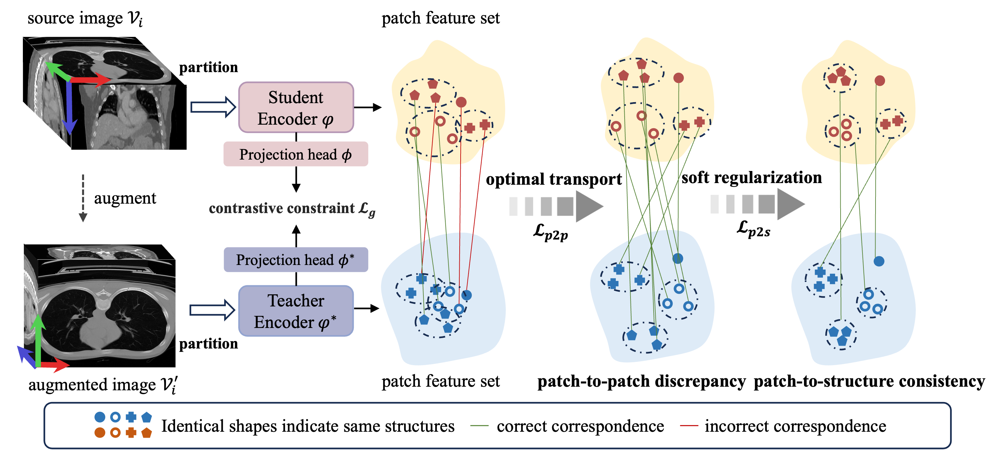

# [[ICCV25]](https://arxiv.org/pdf/2507.02581) Structure-aware Semantic Discrepancy and Consistency for 3D Medical Image Self-supervised Learning
<p align="center">
  
  
</p>

## Timeline
* ✅ September 2025: Pretraining code 

* ✅ December 2025: Downstream code

## Pretraining
Following the datasets in [[VoCo]](https://github.com/Luffy03/VoCo). Please change paths in scripts.
```
cd Pretain
bash train.sh
```

## Downstream
Please refer to the folder 'downstream'.


